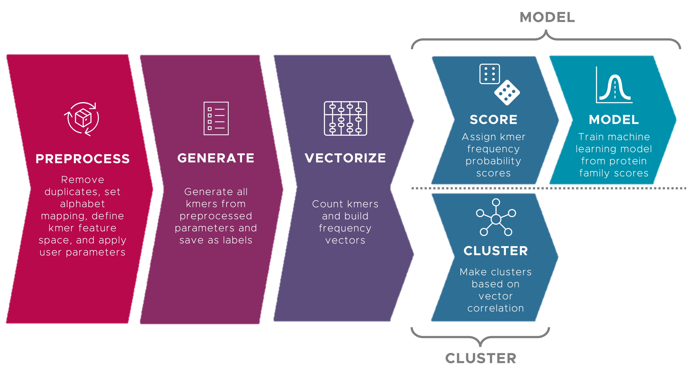

# Snekmer
---------

Pipeline to apply encoded Kmer analysis to protein sequences

<p align="center">
  
</p>

Model mode:

* **Input:** FASTA files containing protein sequences in known families
* **Output:** Models of the known protein families based on kmer vector
  analysis
  * _Evaluation output:_ Assessment of model performance

Cluster mode:

* **Input:** FASTA files containing protein sequences
* **Output:** Clusters of similar proteins
  * _Evaluation output:_ Assessment of how well the clusters of similar
  proteins represent functions

## Installation
---------------

We recommend using Anaconda to create a virtual environment. Anaconda handles dependencies and versioning, which simplifies the process of installation.

### Procedure
-------------

Create a conda environment called `snekmer`:

```bash
conda create -n snekmer -c conda-forge -c bioconda biopython matplotlib numpy pandas seaborn snakemake scikit-learn
```

Activate the environment:

```bash
conda activate snekmer
```

Install the `snekmer` package (note: git clone step is optional if you
 already have the repo cloned locally):

```bash
# clone repository if you haven't already
git clone https://github.com/PNNL-CompBio/Snekmer/Snekmer.git

# install from cloned repository
cd Snekmer
pip install .
```

The package should now be ready to use!

#### Troubleshooting Notes
--------------------------

For Windows users: If you are running into conflicts/errors when creating
  the conda environment in Windows, you may need to install the minimal
  version of Snakemake instead:

```bash
conda create -n kmers -c conda-forge -c bioconda biopython matplotlib numpy pandas seaborn snakemake-minimal scikit-learn
```

## Command-Line Interface
-------------------------

To run Snekmer, create a **_config.yaml_** file containing desired
  parameters. A template is provided at **_snekmer/config.yaml_**.
  Note that the **_config.yaml_** file should be stored in the same
  directory as input directory.

Snekmer assumes that input files are stored in the **_input_** directory,
  and automatically creates an **_output_** directory to save all output
  files. Snekmer also assumes background files, if any, are stored in
  **_input/background/_**. An example of the assumed directory structure
  is shown below:

```
.
├── config.yaml
├── input
│   ├── background
│   │   ├── X.fasta
│   │   ├── Y.fasta
│   │   └── etc.
│   ├── A.fasta
│   ├── B.fasta
│   └── etc.
├── output
│   ├── ...
│   └── ...
```

<!-- In particular, be sure to set `output: save_dir` to the desired output file
 directory, and make sure that `input: fasta_dir` is pointing toward the
 directory containing .fasta input files. -->

### Modes
---------

Snekmer has two operation modes: `model` (supervised modeling) and `cluster`
  (unsupervised clustering). Users may choose either mode to best suit their
  use case.

The mode must be specified in the command line, e.g.:

```bash
snekmer model [--options]
```
or

```bash
snekmer cluster [--options]
```

Once the **_config.yaml_** file has been updated, I recommend a dry run:

```bash
snekmer [mode] --dryrun
```

(For instance, in supervised mode, run `snekmer model --dryrun`.)

The output of the dry run shows you the files that will be created by the
 pipeline. If no files are generated, double-check   that your directory
 structure matches the format specified above.

When you are ready to process your files, run:

```bash
snekmer [mode]
```

### Partial Workflow
--------------------

To execute only a part of the workflow, the parameter `--until` can be invoked.
For instance, to execute the workflow only through the kmer vector generation
step, run:

```bash
snekmer [mode] --until vectorize
```

<!-- ### Extra Notes

The Snekmer CLI is ready-to-use in the above format, but if you run
  `snekmer --help`, you'll notice many extra parameters.
  Ignore these for now; these are a WIP still! -->
