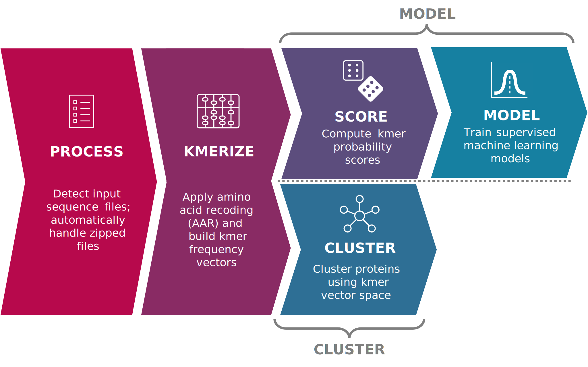

# Snekmer: A scalable pipeline for protein sequence fingerprinting using amino acid recoding (AAR)

Snekmer is a software package designed to reduce the representation of protein sequences
by combining amino acid reduction (AAR) with the kmer approach. Based on the AAR-kmer representations,
Snekmer subsequently (1) clusters sequences using various unsupervised clustering algorithms,
(2) generates supervised machine learning models, or (3) searches sequences against pre-trained models
to determine probabilistic annotations.

  

There are 3 operation modes for Snekmer: `cluster`, `model`, and `search`.

**Cluster mode:** The user supplies files containing sequences in an appropriate format (e.g. FASTA).
Snekmer applies the relevant workflow steps and outputs the resulting clustering results in tabular form (.CSV),
as well as the cluster object itself (.cluster). Figures are also generated (e.g. t-SNE, UMAP) to help the user
contextualize their results.

**Model mode:** The user supplies files containing sequences in an appropriate format (e.g. FASTA).
Snekmer applies the relevant workflow steps and outputs the resulting models as objects (.model). Snekmer also
displays K-fold cross validation results in the form of figures (AUC ROC and PR AUC curves) and a table (.CSV).

**Search mode:** The user supplies files containing sequences in an appropriate format (e.g. FASTA)
and the models they wish to search their sequences against. Snekmer applies the relevant workflow steps
and outputs a table for each file containing model annotation probabilities for the given sequences.

## How to Use Snekmer

For installation instructions, documentation, and more, refer to
the [official documentation](https://snekmer.readthedocs.io).

## Acknowledgments

Snekmer is written and maintained by Christine Chang, Bill Nelson, and Jason McDermott.

## License

    This material was prepared as an account of work sponsored by an agency of the United States Government. Neither the United States Government nor the United States Department of Energy, nor Battelle, nor any of their employees, nor any jurisdiction or organization that has cooperated in the development of these materials, makes any warranty, express or implied, or assumes any legal liability or responsibility for the accuracy, completeness, or usefulness or any information, apparatus, product, software, or process disclosed, or represents that its use would not infringe privately owned rights.

    Reference herein to any specific commercial product, process, or service by trade name, trademark, manufacturer, or otherwise does not necessarily constitute or imply its endorsement, recommendation, or favoring by the United States Government or any agency thereof, or Battelle Memorial Institute. The views and opinions of authors expressed herein do not necessarily state or reflect those of the United States Government or any agency thereof.

    PACIFIC NORTHWEST NATIONAL LABORATORY operated by BATTELLE for the UNITED STATES DEPARTMENT OF ENERGY under Contract DE-AC05-76RL01830
