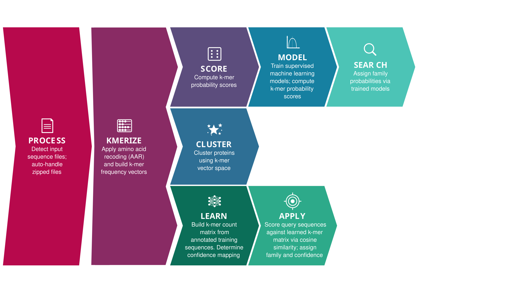

.. Snekmer documentation master file, created by
   sphinx-quickstart on Fri Jun 10 14:20:41 2022.
   You can adapt this file completely to your liking, but it should at least
   contain the root `toctree` directive.

Snekmer: Reduced K-mer Encoding for Protein Sequences
=====================================================

Snekmer is a software package for protein sequence annotation and analysis using amino acid
reduction (AAR) combined with k-mer representations. Given a set of annotated training sequences,
Snekmer builds family-specific k-mer profiles and uses cosine similarity to predict annotations
for new sequences with calibrated confidence scores. Snekmer also supports unsupervised clustering
and supervised machine learning models.

Annotation Pipeline (Learn/Apply)
----------------------------------

The primary use case for Snekmer is sequence annotation via the Learn/Apply pipeline.

**New to Snekmer? Start here:**

1. :doc:`Install Snekmer <getting_started/install>`: set up a Python virtual environment
   and install the package.
2. Run ``easy`` with your training sequences, query sequences, and annotation file:

.. code-block:: bash

   snekmer easy \
       --train  path/to/training_sequences/ \
       --query  path/to/query_sequences.fasta \
       --ann    path/to/annotations.ann \
       --output results/

``easy`` runs the complete pipeline from a single command with no directory setup
or config file required. See the :doc:`easy tutorial <tutorial/snekmer_easy_learn_apply_tutorial>`
to get started with the included demo data.

**easy:** Guided front-end that runs Learn then Apply end-to-end. Handles workspace
setup, annotation generation (from a file or from FASTA headers with ``--create-ann``), and
the handoff between pipeline stages automatically.

**Learn** *(advanced)*: Builds a k-mer association matrix and confidence model from annotated
training sequences. Produces three outputs used by Apply: a cumulative k-mer counts matrix,
family-level score thresholds, and a global confidence distribution.

**Apply** *(advanced)*: Scores query sequences against the outputs from Learn using cosine
similarity. Produces a prediction table with family assignments and calibrated confidence scores.

Use ``learn`` and ``apply`` directly when incrementally updating an existing model or when
fine-grained control over intermediate pipeline steps is needed.

Additional Modes
-----------------

:doc:`Cluster <tutorial/snekmer_demo>` **:** Unsupervised clustering of sequences based on k-mer profiles. Outputs a
cluster assignment table (CSV) and optional figures (t-SNE, UMAP, PCA).

:doc:`Model <tutorial/snekmer_demo>` **:** Trains supervised (one-vs-rest) machine learning models from annotated sequences.
Outputs model objects (.model) and K-fold cross-validation figures (AUC ROC, PR AUC).

:doc:`Search <tutorial/snekmer_demo>` **:** Scores unknown sequences against models produced by ``snekmer model``. Outputs
per-family annotation probability tables.

.. toctree::
   :caption: Getting Started
   :maxdepth: 1
   :hidden:
   
   getting_started/install
   getting_started/quickstart
   getting_started/cli
   getting_started/usage
   getting_started/config
   getting_started/advanced

.. toctree::
   :caption: Tutorial
   :maxdepth: 1
   :hidden:

   tutorial/index
   tutorial/snekmer_easy_learn_apply_tutorial
   tutorial/snekmer_demo
   tutorial/snekmer_learnapp_tutorial

.. toctree::
   :caption: Background
   :maxdepth: 1
   :hidden:

   background/overview
   background/ml
   background/params

.. toctree::
   :caption: Troubleshooting
   :maxdepth: 1
   :hidden:

   troubleshooting/common
