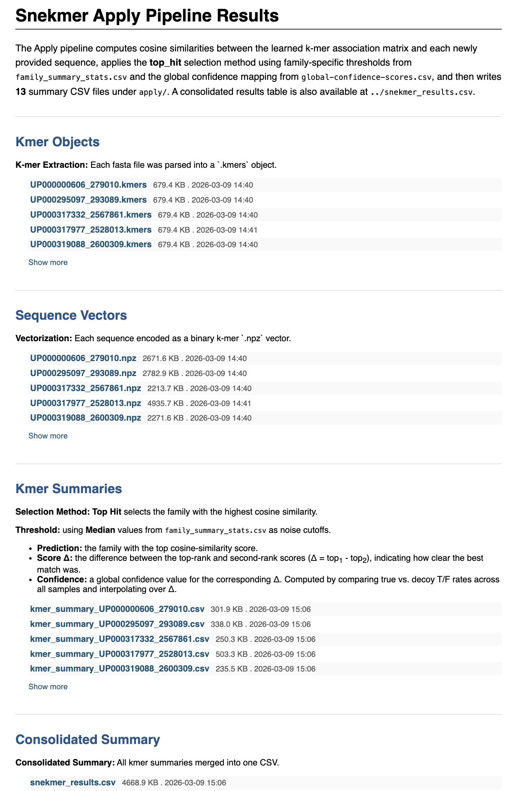

Tutorial
========

Running the Tutorial
--------------------

To run an example set of jobs use the following commands:

.. code-block:: bash

   source ~/snekmer_env/bin/activate
   cd resources/tutorial
   jupyter notebook snekmer_demo.ipynb

This will execute the snekmer model, search, and cluster modes in succession
on a set of three input families and produce output files for each in output.

Running the Learn/Apply Tutorial  
--------------------  

To run an example set of fasta files use the following commands:  
  
.. code-block:: bash

   source ~/snekmer_env/bin/activate
   cd resources/tutorial
   jupyter notebook snekmer_learn_apply_tutorial.ipynb

Evaluating Results
------------------

All Snekmer modes except Model and Learn summarize write an html summary of their results to ``output/Snekmer_<Mode>_Report.html``. Below is an example of the report output from Apply:

See the :ref:`Accessing Results <usage-results>` section for more details.

